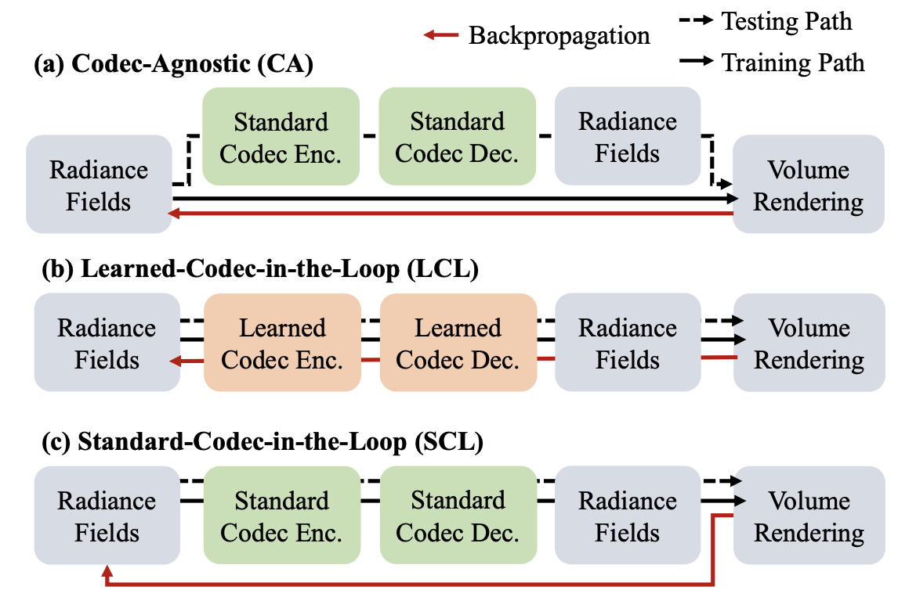

<div align="center">

# CATRF: Codec-Adaptive TriPlane Radiance Fields for Volumetric Content Delivery

**CVPR2026 Findings**

</div>

[](https://tung-i.github.io/catrf-cvpr-findings-2026/)
[](https://arxiv.org/abs/2605.18054)



## :book: Overview
CATRF is a standard-codec-in-the-loop training framework for plane-factorized radiance fields. This folder contains both the static-scene and dynamic-scene implementation of CATRF. For static scenes, the static_catrf branch builds on a TensoRF backbone and fine-tunes the learned feature planes through JPEG. For dynamic scenes, this branch builds on a TeTriRF-style temporal TriPlane radiance field backbone and fine-tunes the learned feature planes through real standard video codec roundtrips, including AV1, HEVC, and VP9.

The training of CATRF consists of two major stages:

1. Vanilla TriPlane pre-training
Train the static/dynamic TriPlane radiance field backbone without codec artifacts.
2. Standard-codec-in-the-loop fine-tuning
Quantize and pack learned feature planes into codec-compatible 2D canvases, run a standard codec roundtrip, unpack/dequantize the decoded planes, and optimize the rendered reconstruction quality using a straight-through estimator (STE). This adapts TriPlanes to standard codec compression artifacts. The resulting TriPlanes can then be compressed into compact bitstreams using standard codecs without comprimising rendering quality after decompression.

### Volumetirc image Compression Performance

### Volumetric video Compression Performance

## Environment Setup

CATRF contains two branches of code: a static branch based on [NeRFCodec](https://github.com/JasonLSC/NeRFCodec_public) and a dynamic branch based on [TeTriRF](https://github.com/wuminye/TeTriRF).

### Static branch

```bash
cd envs
conda env create -n catrf_static -f envs/environment_static.yml
conda activate catrf_static
conda env create -n catrf_dynamic -f envs/environment_dynamic.yml
conda activate catrf_dynamic

torch==2.2.1+cu118
```


## Acknowledgements

The static branch builds on [NeRFCodec](https://github.com/JasonLSC/NeRFCodec_public) and a dyndynamic branch builds on [TeTriRF](https://github.com/wuminye/TeTriRF).

## Citation
If you find this repository useful, please cite CATRF:

@inproceedings{chen2026catrf,
  title={CATRF: Codec-Adaptive TriPlane Radiance Fields for Volumetric Content Delivery},
  author={Chen, Tung-I and Wang, Lingdong and Maji, Subhransu and Sitaraman, Ramesh K},
  booktitle={Proceedings of the IEEE/CVF Conference on Computer Vision and Pattern Recognition},
  pages={457--467},
  year={2026}
}